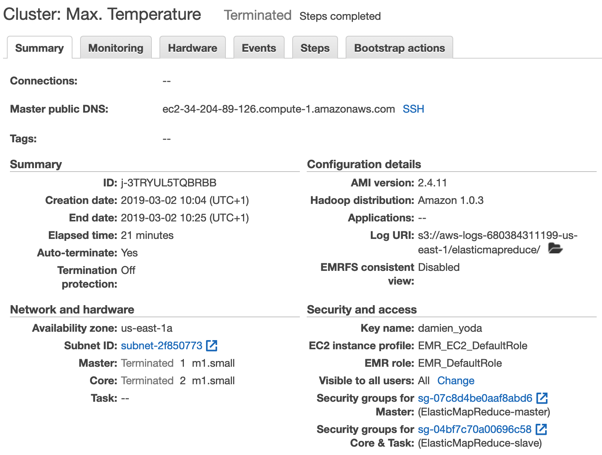
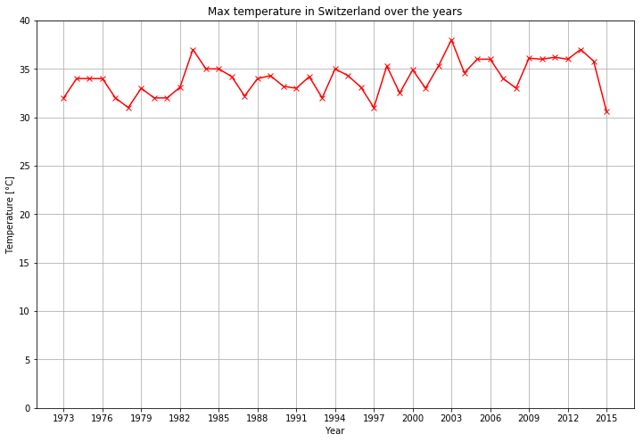
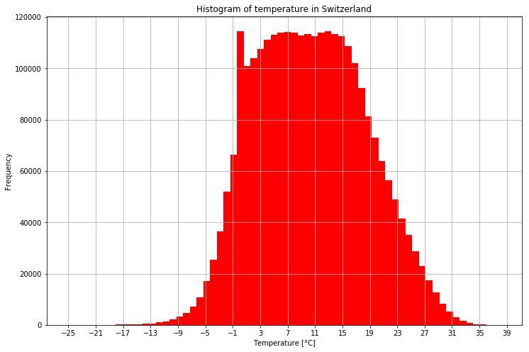

# BDA - Lab 01: Hadoop MapReduce in the cloud

Damien Rochat <damien.rochat@master.hes-so.ch>  
Dorian Magnin <dorian.magnin@master.hes-so.ch>  
Nelson Rocha <nelson.rocha@master.hes-so.ch>

## Task 2: Using Elastic MapReduce

#### EMR console summary



#### Max temperature chart



The overall highest recorded temperature is of 38.0 °C in 2003, year of the European heat wave.

#### EC2 instances

We used 3 m1.small instances (1 master and 2 cores).
For each one, the price of the on-demand EC2 is $0.044 + $0.011 for the EMR per hour.
Our cluster ran during 21 minutes.

The total cost is of **$0.0693** (`($0.055+$0.011)*3*0.35 = $0.0693`).

#### EMR job

From the job log file, the Mappers processed **2'831'380** input records (MAP_INPUT_RECORDS) and produced **2'821'078** records (MAP_OUTPUT_RECORDS).  
The Reducers processed **2'821'078** input records (REDUCE_INPUT_RECORDS) and produced **43** records (REDUCE_OUTPUT_RECORDS).

## Task 3: Writing a MapReduce program

#### Source code

##### count_temperature_map.py

```python
#!/usr/bin/env python
#
# max_temperature_map.py - Count temperature from NCDC Global
#                          Hourly Data - Mapper part

import re   # import regular expressions
import sys  # import system-specific parameters and functions

map_count = {}

# loop through the input, line by line
for line in sys.stdin:
  # remove leading and trailing whitespace
  val = line.strip()
  # extract values for temperature and quality indicator
  temp = val[87:92]
  q = val[92:93]
  # temperature is valid if not +9999 and quality indicator is
  # one of 0, 1, 4, 5 or 9
  if (temp != "+9999" and re.match("[01459]", q)):

    # binning of the temperature
    temp = int(float(temp)/10)

    map_count[temp] = map_count.get(temp, 0) + 1

# produce output
for temp, count in map_count.iteritems():
    print "%s\t%s" % (temp, count)
```

##### count_temperature_reduce.py

```python
#!/usr/bin/env python
#
# max_temperature_reduce.py - Count temperature from NCDC Global
#                             Hourly Data - Reducer part

import sys

last_key = None
count = 0
# loop through the input, line by line
for line in sys.stdin:
  # each line contains a key and a value separated by a tab character
  (key, val) = line.strip().split("\t")
  # Hadoop has sorted the input by key, so we get the values
  # for the same key immediately one after the other.
  # Test if we just got a new key, in this case output the count
  # temperature for the previous key and reinitialize the variables.
  # If not, keep counting temperature.
  if last_key and last_key != key:
    print "%s\t%s" % (last_key, count)
    count = int(val)
  else:
    count = count+int(val)
  last_key = key

# we've reached the end of the file, output what is left
if last_key:
  print "%s\t%s" % (last_key, count)
```

We also tried a non-optimized version of the code (without "In-Mapper combining") and obtained a time difference of 3 minutes (10 minutes instead of 7 minutes) on the EMR step duration.

#### Stats

How often does the temperature 22 degrees celsius occur? **56'530 times**

What is the lowest and highest temperature occuring? **min: -25 °C, max: 38 °C**

Which temperature occurs most often? **13 °C with 114'613 occurences**

#### Histogram


